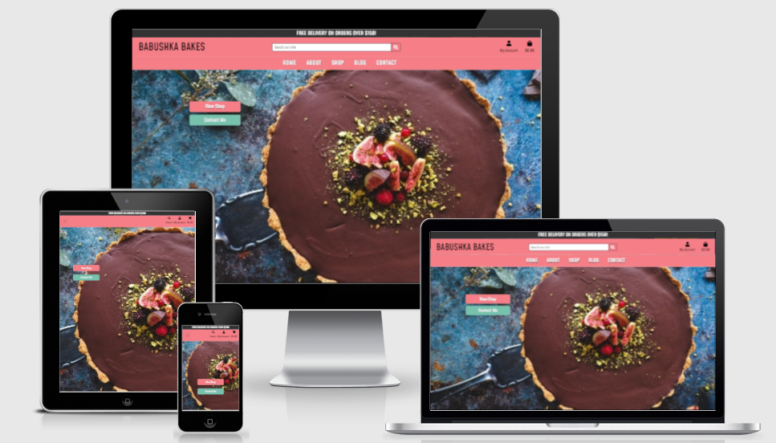
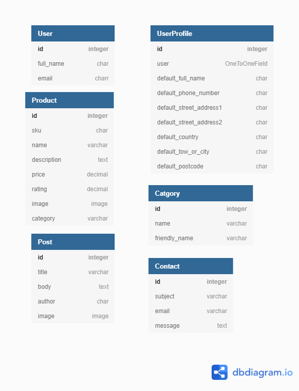
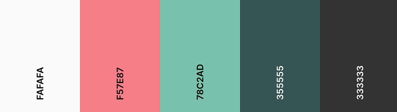

# **Babushka Bakes**




## **About the project**

Babushka Bakes is a lovely small bakery run by the pastry chef Petra Dragojlovic. She specializes in making cakes and different kinds of bread. She wanted a website that will showcase her work and where she can keep in contact with her customers. As this is her business, she wanted to be able to offer some products for sale in the online shop but also have an option for people to contact her for
custom orders. I created a site that contains a blog - where she can communicate any news about her products and share some of her famous recipes, then there is a shop - where customers can order some of the staples from her kitchen, and through the contact form - people can contact her for any questions or orders they wish to place.

[View Live Site]()

<a></a>

## Table of contents 
* [UX](#ux)
* [The Strategy Plane](#the-strategy-plane)
    * [User Goals](#user-goals)
    * [Site Owners Goals](#site-owners-goals)
    * [User Stories](#user-stories)
* [The Scope Plane](#the-scope-plane)
    * [Existing Features](#existing-features)
    * [Features to be implemented](#features-to-be-implemented)
* [The Structure Plane](#the-structure-plane)
* [The Skeleton Plane](#the-skeleton-plane)
    * [Wireframes](#wireframes)
    * [Database Structure](#database-structure)
* [The Surface Plane](#the-surface-plane)
    * [Design Choices](#design-choices)
        * [Fonts](#fonts)
        * [Colors](#colors)
* [Technologies used](#technologies-used)
    * [Languages](#languages)
    * [Libraries and Frameworks](#libraries-and-frameworks)
    * [Tools](#tools)
* [Testing](#testing)
* [Deployment](#deployment)
    * [Heroku Deployment](#heroku-deployment)
    * [Run Locally](#run-locally)
    
* [Credits](#credits)

--- 

<a name="ux"></a>

# **UX**

<a></a>

## **The Strategy Plane**


### **User Goals**

 Users can be divided in two categories:

* #### **Site Visitor / Shopper**

   Site visior/shopper's goal is to be able to easily browse the website on any device so that they can quickly find what they are   looking for. Whether that is to buy products or just find some inspiration for their own baking. The easier is to find the contact information to contact the site owner, the better experience they will have. They need to clearly see what is the benefit of signing up for the account and what benefits will that bring them. 

* #### **Admin/Staff**

  Admin/Staff goal is to maintain the website as per site owners wishes. They need to have an easy access to the admin panel and the login details so they can update the content required. The site needs to be intuitive for them and clearly show options for adding and updating products, blog posts etc. 


[Back to Top](#table-of-contents)

<a></a>

### **Site owners Goals**

* Site owner Petra's goal is to have a website that will represent her as a pastry chef and a person. 
* To have a place where she can showcase her work and be able to communicate with her visitors which will hopefully turn into customers. 
* She would like to offer some of her best selling products in the online shop. 
* To have an option where people can reach out to her to order custom products 
* To have the possibility to Add, Edit, and Delete products.
* To have the possibility to Add, Edit, and Delete blog posts.
* To provide a secure payment method for customers.

<a></a>

### **User Stories**

| Site   Visitor | Easily register for an account               | Have my account and view my   profile                                               |
|----------------|----------------------------------------------|-------------------------------------------------------------------------------------|
|                | Easily login and logut                       | Access my account                                                                   |
|                | Easily recover my password if neccesary      | Log back in to my account if I forget my password                                   |
|                | Contact the store owner                      | Ask a question regarding products or place a custom order                           |
|                | Read the blog                                | Find some reciepts that I can try                                                   |
| Shopper        | View the products in the shop                | Choose what to buy                                                                  |
|                | Search for products by name or description   | Find them easily without going through all products                                 |
|                | See product details                          | Find out if I want to purchase it                                                   |
|                | Add product to the cart                      | Purchase it                                                                         |
|                | Adjust the items in cart                     | Purchase  only products and amounts   that I want                                   |
|                | See total of my cart at any time             | Control my spending                                                                 |
|                | Make a safe purchase                         | Trust that my payment details are confidential                                      |
|                | Receive an email confirmation after purchase | Have the details of my order in case I need to contact the shop                     |
|                | Contact the store owner                      | Ask a question regarding products or place a custom order                           |
|                | Read the blog                                | Find some reciepts that I can try                                                   |
| Admin/Staff    | Add/edit/remove products from the shop       | Keep my shop up to date with my offer                                               |
|                | Add/edit/remove blog posts                   | Inform my cutomers about news and share receipts                                    |
|                | Receive emails from the contact form         | Take orders and reply to my customers, keep the details for future   markeing etc.. |

[Back to Top](#table-of-contents)

<a></a>

## **The Scope Plane**

<a></a>

## **Features**


<a></a>

### **Features Planned**


* Website that is fully responsive on desktop, tablet and mobile
* Navigation at the top to guide the cutomer troughout the site 
* Products page to showcase all the products
* Search field so customers can search for products quicker
* Shopping cart so customers can purchase the products
* Safe checkout and payment option 
* Possibility for customers to create an account in order to shop for products
* Blog page where site owner will post news and recipes
* Contact form through which customers can contact the site owner directly


<a></a>

### **Features Left to implement**

The website is currently a fully functional shop that covered all site owners wishes and can be used as such. However there is still lots of ideas to improve it and make the customer experience better. Some of the features that I was not able to implement for this release and would love to in the future:
* Workshops tab that will show details of events and workshops that Petra is hosting
* Option for visitors to apply and pay for the workshop
* A possibility to login with visitor's social media account to make the process even shorter and smoother
* An option for visitors to comment on the blog posts
* Pagination for the products page and blog page
* Add some videos of the Bakery and Petra at work 
* Link the actual Petra's social media pages in the footer, instead of a generic page


[Back to Top](#table-of-contents)

<a></a>

## **The Structure Plane**

The plan is to have a simple website that is easy to use and intuitive for the user.
All the pages will have the same heading that will contain the logo, main navigation menu, the search bar, the account login and the shopping cart. 

#### **Home Page**

Home page will have a nice hero image that should clearly tell the user what the website is about and tempt him to explore futher. I will also add a couple of buttons to lead directly to the shop and the contact form.
#### **About Page**

About page is here to tell the story of Babushka Bakes and its owner, Petra. It will contain her short biography and images, plus a CTA button.
#### **Shop Page**

Will contain the list of all the products available in the shop, along with their images, prices and rating. 
From this page, the user, when clicked on an individual product, will be sent to a product details page. After adding products into the cart the user will be directed to a shopping cart page and if he decides to purchase, will be redirected to a checkout page.

#### **Blog Page**

This page will have the list of blog posts from Petra. Each post will contain of the image, title and subtitle and it will be clickable so the visitor can open the article to read it on a separate page. 

#### **Contact Page**

The contact page will have the contact from where visitors can easily contact the site owner. This form will be sending emails directly to site owners inbox. There will also be a map and address for the Bakery, and a CTA button. 

#### **Footer**

Footer will be very simple, it will contain navigation menu links for easy navigation throughout the site and social media icons that will lead to respective social media websites. 
## **The Skeleton Plane**
<a></a>


### **Database Schema**

 





### **Wireframes**

[Home Page](media/home.png)\
[About Page](media/about.png)\
[Shop Page](media/shop.png)\
[Product Page](media/product.png)\
[Blog Page](media/blog.png)\
[Blog Details Page](media/blog-details.png)\
[Contact Page](media/contact.png)


## **The Surface Plane**

### **Design Choices**

<a></a>

#### **Colors**

I wanted the website to have a warm feel to it and to invoke feelings of happines and remind us of something sweet and soft, as desserts usually make us feel. I decided to use use the pink and bluish/green color for the website, with some dark grey and white to contrast it. 




<a></a>

#### **Typography**

Apart from looking like a happy place, I wanted the website to also have an elegant feel to it so I have chosen the Mohave font for the majority of the webiste.

Messages from the site owner are written in Dancing Script fornt to feel more personal, as if she wrote them by hand. 

<a></a>


[Back to Top](#table-of-contents)

---

<a></a>

# **Technologies used**

<a></a>

### **Languages**

* [HTML](https://en.wikipedia.org/wiki/HTML)
* [CSS](https://en.wikipedia.org/wiki/Cascading_Style_Sheets)
* [JavaScript](https://en.wikipedia.org/wiki/JavaScript)
* [Python](https://www.python.org/)

<a></a>

### **Libraries and Frameworks**

* [Django]()
* [Font Awesome](https://fontawesome.com/)
* [Bootstrap](https://getbootstrap.com/)
* [Google Fonts](https://fonts.google.com/)
* [jQuery](https://jquery.com/)

### **Tools**
* [Git](https://git-scm.com/)
* [GitPod](https://www.gitpod.io/)
* [Heroku](https://www.heroku.com/)
* [Balsamiq](https://balsamiq.com/wireframes/)
* [W3C HTML Validation Service](https://validator.w3.org/)
* [W3C CSS Validation Service](https://jigsaw.w3.org/css-validator/)
* [Python Validator](http://pep8online.com/)
* [techsini](http://techsini.com/)
* [Jinja](https://jinja.palletsprojects.com/en/2.11.x/)

[Back to Top](#table-of-contents)

<a></a>


# **Testing**

The full testing procedure can be found in the [Testing](testing.md) file


[Back to Top](#table-of-contents)

<a></a>

# **Deployment**

## Run Locally

To run this project locally on your machine you will need to clone it first. Please follow the steps:

1. From the application's repository, click the "code" button and download the zip of the repository.
    Alternatively, you can clone the repository using the following line in your terminal:

    ``` 
    git clone https://github.com/TanYa-Go/Babushka-Bakes.git
    ``` 

1. Access the folder in your terminal window and install the application's [link to required modules](https://github.com/TanYa-Go/Babushka-Bakes/blob/main/requirements.txt) using the following command:

    ```
    pip3 install -r requirements.txt
    ```

1. In your IDE, create a file containing your environmental variables called env.py at the root level of the application. 
    It will need to contain the following lines and variables:
    ```
    import os

    os.environ["SECRET_KEY"] = "YOUR_SECRET_KEY"
    os.environ["DEVELOPMENT"] = "True"

    os.environ["DEFAULT_FROM_EMAIL"] = 'DEFAULT_FROM_EMAIL'

    os.environ["STRIPE_PUBLIC_KEY"] = "STRIPE_PUBLIC_KEY"
    os.environ["STRIPE_SECRET_KEY"] = "STRIPE_SECRET_KEY"
    os.environ["STRIPE_WH_SECRET"] = "STRIPE_WH_SECRET"
    os.environ["STRIPE_CURRENCY"] = "USD"

    ```
    
    To get the above variables you will need to create a Stripe account. Please visit the [Stripe Documentation](https://stripe.com/docs) for more information.

    If you plan on pushing this application to a public repository, ensure that env.py is added to your .gitignore file.

1. Migrate the database models with the following command
    ```
    python3 manage.py migrate
    ```
1. Create a superuser and set up the credentials with the following command
    ```
    python3 manage.py createsuperuser
    ```
1. Run the app with the following command
    ```
    python manage.py runserver
    ```
    The address to access the website is displayed in the terminal  
    Add **"/admin"** to the end of the url to access the admin panel. You need to log in with your superuser credentials

## Heroku Deployment

1. Login to your Heroku account and create a new app. Choose your region. 
1. Once the app is created click on the resources button and under Add-ons, look for the Heroku Postgres to attach a postgres database to your project.
    Select the Hobby Dev - Free plan and click 'Submit order form'

1. Scroll back up and click "settings". Scroll down and click "Reveal config vars". Set up the same variables as in your env.py ():
    !You shouldn't set the DEBUG variable in under config vars, only in your env.py to prevent DEBUG being active on live website. 

    ```
    AWS_ACCESS_KEY_ID = "AWS_ACCESS_KEY_ID"
    AWS_SECRET_ACCESS_KEY = "AWS_SECRET_ACCESS_KEY"
    AWS_S3_REGION_NAME = "AWS_S3_REGION_NAME"
    AWS_STORAGE_BUCKET_NAME = "AWS_STORAGE_BUCKET_NAME"
    USE_AWS = True
    AWS_S3_ADDRESSING_STYLE = "path" - **this setting is specific to the 'eu-central-1' region**
    DATABASE_URL = "This variable is automatically set when adding the Postgres Add on"

    SECRET_KEY = "SECRET_KEY"

    STRIPE_PUBLIC_KEY = "STRIPE_PUBLIC_KEY"
    STRIPE_SECRET_KEY = "STRIPE_SECRET_KEY"
    STRIPE_WH_SECRET = "STRIPE_WH_SECRET"
    STRIPE_CURRENCY = USD

    DEFAULT_FROM_EMAIL = "DEFAULT_FROM_EMAIL"
    EMAIL_HOST = "smtp.gmail.com"
    EMAIL_HOST_PASS = "EMAIL_HOST_PASS"
    EMAIL_HOST_USER = "EMAIL_HOST_USER"
    EMAIL_PORT = 587
    EMAIL_USE_TLS = True
    ```
1. From this screen, copy the value of DATABASE_URL
1. After this go to your settings.py file and comment out the default database configuration and add:
    ```
    DATABASES = {
        'default': dj_database_url.parse('Put your DATABASE_URL here'))
    }
    ```
1. Migrate again with the following command
    ```
    python3 manage.py migrate
    ```


1. Create a superuser for the postgres database so you can have access to the django admin by setting up the credentials with the following command
    ```
    python3 manage.py createsuperuser
    ```

    Login to the admin panel and mark your email address as verified, check the boxes 'Verified and primary"

1. Load the data into your newly created database by using the following command: 

    ```
    python3 manage.py loaddata <name of file containing the data >
    ``` 

1. After migrations are complete, change database configurations to:
```
    if 'DATABASE_URL' in os.environ:
        DATABASES = {
            'default': dj_database_url.parse(os.environ.get('DATABASE_URL'))
        }
    else:
        DATABASES = {
            'default': {
                'ENGINE': 'django.db.backends.sqlite3',
                'NAME': os.path.join(BASE_DIR, 'db.sqlite3'),
            }
        }
```
This set up will allow your site to use Postgres in deployment and sqlite3 in development.


1. Make sure you have your requirements.txt file and your Procfile. In case you don't, follow the below steps:
    Requirements:
    ```
    pip3 freeze --local > requirements.txt
    ```
    Procfile:
    ```
    echo web: python app.py > Procfile
    ```
1. The Procfile should contain the following line:
    ```
    web: gunicorn <project_name>.wsgi:application

     ** Make sure there is a space after the colon, otherwise it will not work. 

    ```

1. Add your files and commit them to GITHUB by running the following commands:
    ```
    git add . 
    git commit -m "Your commit message"
    git push
    ```

1. Add your Heroku app URL to ALLOWED_HOSTS in your settings.py file
1. Disable collect static so that Heroku doesn't try to collect static files when you deploy by typing the following command in the terminal
    ```
    heroku config:set DISABLE_COLLECTSTATIC=1
    ```
1. Go back to HEROKU and click "Deploy" in the navigation. 
1. Scroll down to Deployment method and Select Github. 
1. Look for your repository and click connect. 
1. Under automatic deploys, click 'Enable automatic deploys'

1. Just beneath, click "Deploy branch". Heroku will now start building the app. When the build is complete, click "view app" to open it.
1. In order to commit your changes to the branch, use git push to push your changes. 


1. Static and media files  for this project are stored in an AWS S3 bucket. You can find more information about this on [Amazon S3 Documentation](https://docs.aws.amazon.com/AmazonS3/latest/userguide/Welcome.html).
   


[Back to Top](#table-of-contents)

<a></a>

# **Credits**

### **Code**

Code institute Cris Zielinski's Boutique Ado project was a great help while creating this project


### **Media**


### **Acknowledgements**


[Back to Top](#table-of-contents)