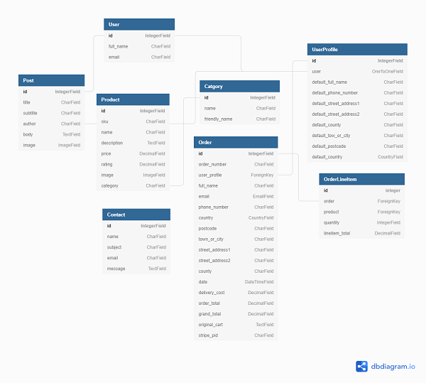

# **Babushka Bakes**

## **Babushka Bakes**

Babushka Bakes is a lovely small bakery run by the pastry chef Petra Dragojlovic. The two big passions of hers are making cakes for any occasion and making different kinds of bread. She can make all your other pastry wishes come through but these are her two true loves.
She wanted a website that will showcase her work, keep in contact with her customers, and where she will also be able to receive orders. I created a site where she can communicate any news about her products and share some of her famous recipes through the blog. Then there is a shop where customers can order some of the staples from her kitchen, and through the contact form people can contact her for any questions or orders they wish to place.

[View Live Site]()

## Table of contents 
* [UX](#ux)
* [The Strategy Plane](#the-strategy-plane)
    * [User Goals](#user-goals)
    * [Site Owners Goals](#site-owners-goals)
    * [User Stories](#user-stories)
* [The Scope Plane](#the-scope-plane)
    * [Existing Features](#existing-features)
    * [Features to be implemented](#features-to-be-implemented)
* [The Structure Plane](#the-structure-plane)
* [The Skeleton Plane](#the-skeleton-plane)
    * [Wireframes](#wireframes)
    * [Database Structure](#database-structure)
* [The Surface Plane](#the-surface-plane)
    * [Design Choices](#design-choices)
        * [Fonts](#fonts)
        * [Colors](#colors)
* [Technologies used](#technologies-used)
    * [Languages](#languages)
    * [Libraries and Frameworks](#libraries-and-frameworks)
    * [Tools](#tools)
* [Testing](#testing)
* [Deployment](#deployment)
    * [Heroku Deployment](#heroku-deployment)
    * [Run Locally](#run-locally)
    
* [Credits](#credits)

--- 

# **UX**

## **The Strategy Plane**

### **User Goals**

 Users can be divided in two categories:

* #### **Site Visitor / Shopper**

   Site visior/shopper's goal is to be able to easily browse the website on any device so that they can quickly find what they  are   looking for. Whether that is to buy products or just find some inspiration for their own baking. The easier is to find the contact information to contact the site owner, the better experience they will have. They need to clearly see what is the benefit of signing up for the account and what benefits will that bring them. 

* #### **Staff**

  Staff goal is to maintain the website as per site owners wishes. They need to have an easy access to the admin panel and the login details so they can update the content required. The site needs to be intuitive for them and clearly show options for adding and updating certain details. 

[Back to Top](#table-of-contents)

### **Site owners Goals**

* Site owner Petra's goal is to have a website that will represent her as a pastry chef and a person. 
* To have a place where she can showcase her work and be able to communicate with her visitors which will hopefully turn into customers. 
* She would like to offer some of her best selling products in the online shop but also to have an option where people can reach out to her to order custom products too.
* To have the possibility to Add, Edit, and Delete products.
* To have the possibility to Add, Edit, and Delete blog posts.
* To provide a secure payment method for customers.

### **User Stories**

| As   a             | I want to be able to                   | So that I can…                                                                      |
|--------------------|----------------------------------------|-------------------------------------------------------------------------------------|
|                    |                                        |                                                                                     |
| Visitor            | view the products                      | choose what to buy                                                                  |
|                    | search for products                    | find them easily without going through all products                                 |
|                    | see product details                    | find out if I want to buy it                                                        |
|                    | add product to the cart                | buy it                                                                              |
|                    | remove/edit product from cart          | update my cart and buy product and amounts that I want                              |
|                    | read the blog                          | find some reciepts that I can try                                                   |
|                    | see the list of events                 | find the event or workshop I want to attend                                         |
|                    | see the events details                 | apply if I wish to                                                                  |
|                    | Add/edit/remove products from the shop | keep my shop up to date with my offer                                               |
| Site Owner / Staff | receive messages from the contact form | take orders and reply to my customers, keep the details for future   markeing etc.. |
|                    | Add/edit/remove blog posts             | inform my cutomers about news and share receipts                                    |
|                    | Add/edit/remove events                 | my customers can have the latest information                                        |
|                    | Add/edit/remove products from the shop |                                                                                     |
|                    | Add/edit/remove blog posts             |                                                                                     |
|                    | Add/edit/remove events                 |                                                                                     |
|                    |                                        |                                                                                     |
|                    |                                        |                                                                                     |

[Back to Top](#table-of-contents)

## **The Scope Plane**

## **Features**

### **Features Planned**

* Website that is fully responsive on desktop, tablet and mobile
* Navigation at the top to guide the cutomer troughout the site 
* Search field so customers can search for products quicker
* Possibility for customers to create an account in order to shop for products
* Blog page where site owner will post news and recipes
* Contact form through which customers can contact the site owner directly

### **Features to be implemented**

[Back to Top](#table-of-contents)

## **The Structure Plane**

All the pages will have the same heading that will contain the logo, main navigation menu, the search bar, the account login and the shopping cart. 

#### **Home Page**

Home page will have a nice hero image that should tempt the visitor to explore futher
#### **About Page**

About page is here to tell the story of Babushka Bakes and its owner, Petra. It will contain her short biography and images.
#### **Shop Page**

Will contain the list of all the products available in the shop along with the prices. 

#### **Blog Page**

This page will have the list of blog posts from the owner. Each post will contain of the image, title and subtitle and it will be clickable so the visitor can open the article to read it on a separate page. 

#### **Contact Page**

The contact page will have the contact from where visitors can easily contact the site owner. This form will be sending emails directyl to site owners inbox. There will also be a map and address for the Bakery.  
## **The Skeleton Plane**

### **Database Schema**

 

### **Wireframes**

[Home Page](media/home.png)\
[About Page](media/about.png)\
[Shop Page](media/shop.png)\
[Product Page](media/product.png)\
[Blog Page](media/blog.png)\
[Blog Details Page](media/blog-details.png)\
[Contact Page](media/contact.png)

## **The Surface Plane**

### **Design Choices**

#### **Colors**

I wanted the website to have a warm feel to it and to invoke feelings of happines and remind us of something sweet and soft, as desserts usually make us feel. I decided to use use the pink and bluish/green color for the website, with some dark grey and white to contrast it. 

#### **Typography**

Apart from looking like a happy place, I wanted the website to also have an elegant feel to it so I have chosen the Mohave font for the majority of the webiste.

[Back to Top](#table-of-contents)

---

# **Technologies used**

### **Languages**

* [HTML](https://en.wikipedia.org/wiki/HTML)
* [CSS](https://en.wikipedia.org/wiki/Cascading_Style_Sheets)
* [JavaScript](https://en.wikipedia.org/wiki/JavaScript)
* [Python](https://www.python.org/)

### **Libraries and Frameworks**

* [Django]()
* [Font Awesome](https://fontawesome.com/)
* [Bootstrap](https://getbootstrap.com/)
* [Google Fonts](https://fonts.google.com/)
* [jQuery](https://jquery.com/)

### **Tools**
* [Git](https://git-scm.com/)
* [GitPod](https://www.gitpod.io/)
* [Heroku](https://www.heroku.com/)
* [Balsamiq](https://balsamiq.com/wireframes/)
* [W3C HTML Validation Service](https://validator.w3.org/)
* [W3C CSS Validation Service](https://jigsaw.w3.org/css-validator/)
* [techsini](http://techsini.com/)
* 
* 
* 
* [Jinja](https://jinja.palletsprojects.com/en/2.11.x/)

[Back to Top](#table-of-contents)

# **Testing**

The full testing procedure can be found in the [Testing](testing.md) file

[Back to Top](#table-of-contents)

# **Deployment**

## Heroku Deployment

## Run Locally

[Back to Top](#table-of-contents)

# **Credits**

### **Code**

Code institute Cris Zielinski's Boutique Ado project was a great help while creating this project

### **Media**

### **Acknowledgements**

[Back to Top](#table-of-contents)