# **Testing**

## Table of contents 
* [Code Validation](#code-validation)
* [Responsiveness](#responsiveness)
* [User Stories](#user-stories)
    * [Navigation](#navigation-and-responsiveness)
    * [Account Creation](#account-creation-and-profile-management)
    * [Contact](#contact)
    * [The Blog](#the-blog)
    * [The Shop](#the-shop)
    * [Search](#search-functionality)
* [Error Pages](#error-pages)
* [Bugs](#bugs)
* [Important](#important)

 

# **Code Validation**

### **HTML**
All the HTML files were validated with [HTML Validator](https://validator.w3.org/).

There were only a few minor errors such as:
* double closing tags
* missing closing tags
* nested **a** element inside the **button** element

These errors were fixed and there are no errors or warnings left. 

### **CSS**
All the CSS files have passed the [CSS Validator](https://jigsaw.w3.org/css-validator/) without issues.

### **JavaScript**
All the javascript were validated with the [Javascript Validator](https://jshint.com/) 

* Missing semicolon was added
* Undefined variable ($) warning was not changed or fixed as it would lead to code not working  
* The warning 'template literal syntax' is only available in ES6 (use 'esversion: 6'), was fixed by changing jshint configuration to ES6

### **Python**

All the python files were validated with the [Pep8 Python validator](pep8)

Most common errors / warnings were:
* Blank line contains whitespace
* Trailing whitspace
* Line too long - some of which could not be corrected as it would break the code
* Missing docstring
* Unused imports
* No new line at the end of file
* Expected two blank lines, found one
* Too many blank lines

Majority of the errors and warnings was fixed, however some still remain, becasue breaking those lines would break the code:
* "Line too long" in migration files
* "Line too long" in settings file
* "Avoid using null=True on string-based fields such CharField" in some models

  

# **Responsiveness**

### **Test**
I was regularly checking responsiveness during development with Chrome developer inspector tools.\
I have tested the deployed site with help of the app called [Responsively](https://responsively.app/).\
Test was also done on the actual devices: Lenovo Laptop 17.3" / Alpha a1 20+ / Xiaomi Redmi 9t /  iPhone 7 / iPhone 8 / iPhone 10 / iPad 

### **Result**
After testing, there was a need to adjust some font sizes and margins to acheieve the satisfactorty result on all devices.\
The page is optimized for the devices from minimum of 320px screen size\
The page looks satisfactory on all tested devices and is fully responsive.\
The Navigation menu collapses on tablet and mobile sizes and expands on desktop size.\
Images are not distorted and display nicely on all screen sizes tested.\
Text responsiveness is satisfactory.

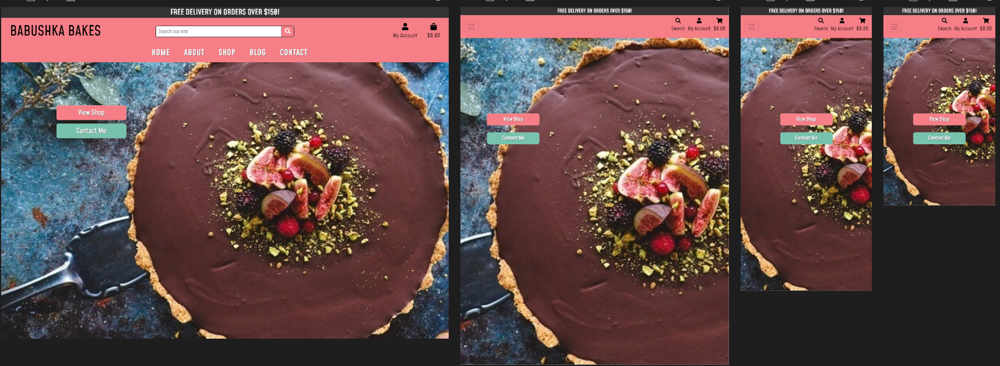
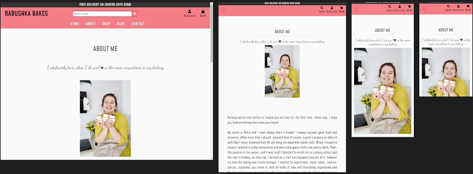
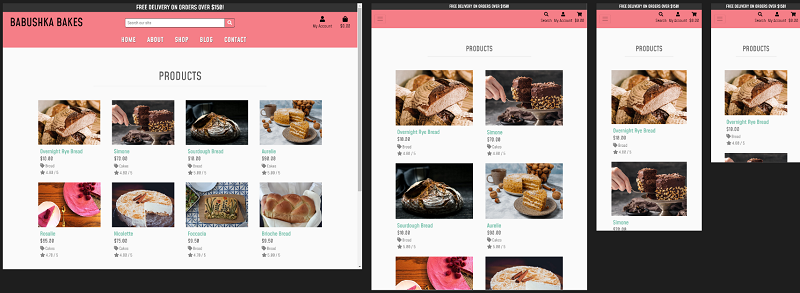
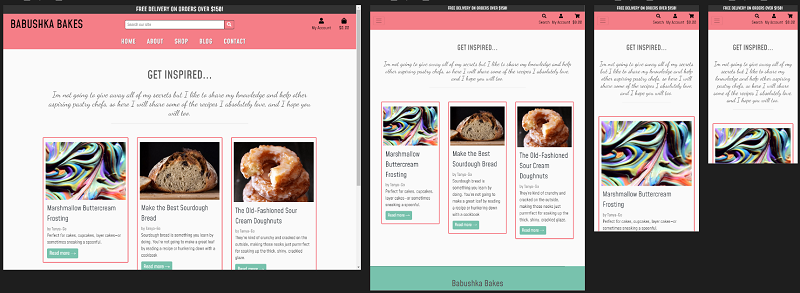

### **Browsers**
I have tested the app in the following browsers:

* Chrome
* Opera
* Mozilla Firefox
* Microsoft Edge
* Safari was tested on mobile phones only and works as intended

The website displays properly in all tested browsers, the images are not distorted and all sections and text are clearly visible.

### **Conclusion**
Test passed, everything is functioning as intended.

 
 

# **User Stories**

## **Navigation and responsiveness**
### **All users** 

User Story:
* *To have a website that is clean and easy to navigate and displays well on all devices*

Responsiveness was covered in the separate section above, and the results are satisfactory.

Navigation bar is visible on all pages of the website  which makes it easy for user to browse around and contributs to a smoother user experience.

On smaller sizes, the navigation menu collapses to a hamburger button which expands on a click. 

### **Test**

**Navigation menu items**

* Clicked on each navigation menu item to make sure that they each lead to their respective pages. 
* Clicked on the **View Shop** and **Contact Me** buttons to make sure that they lead to their respective pages. 

**Footer menu items**

* Clicked on each navigation menu item in the footer to make sure that they lead to their respective pages. 

**Social Media Icons**

* Clicked on each social media icon in the footer to make sure that they lead to their respective pages. 

**Buttons**

* Clicked on each button on all pages of the website to make sure they will lead to the relevant page. 

**Brand Name**

* To return to the **Home** Page, the user can click on the brand name in the top left corner and will be redirected to the home page. 

### **Result**  

No broken links in navbar, all pages open as expected.\
**Shop** link opens a dropdown menu on hover, as expected.\
Social media icons lead to their respective generic page and open in a separate tab.\
All buttons work as expected and lead to their respective pages.

### **Conclusion**
Test passed, all functions work as expected.

  

## **Account Creation and Profile Management**
### **Site Visitor**

This could be a first time visitor as well as a returning visitor who hasn't created an account previously.

* User Stories:
    * *As a	site visitor I want to be able to:*
        * *Easily register for an account so that I can have my account and view my profile.*
        * *Easily login and logut* 
        * *Easily recover my password if neccesary*

Benefits of creating an account:
* Personal information saved in their profile for easier future purchases
* Having a list of past orders saved in their account
* Receiving notifications about discounts, giveaways etc. 

The **My Account** icon is placed in the website header and it is clearly visible and accessible from any page of the website.\
Visitor should be able to click on the **My Account** icon and see the options to **Login** or **Register**\
When the visitor clicks on **Register** they should be presented with a form asking for their details.\
After submitting the form, an email confirmation should be required.\
When the visitor confirms their email, they should be able to log in with their new credentials.

As a **logged-in** user, the user can now see additional option in the **My Account** dropdown menu - **Profile Management**.\
From here the user can update their profile information that are saved for future purchases.\
List of past orders should be saved in their account as well.\
To recover ther password they should be able to click on the **Forgot Password** link and follow the instructions to change the password.\
The user should easily log out by clicking the **Logout** link in the **My Account** menu.\
They shouold be asked to confirm if they really want to logout, in case they have clicked this link by accident.  

### **Test**
I have tried to register for a new account.   
I have tried to login with my new credentials.  
I tried to change my details and click **Update Information**.\
I have tried to change my password and I have received an email with a link to reset it. 
I have tested the logout button.

**Form Validation**

The **Sign Up** form will not allow submission if all the fields are not filled out.  
All fields are required and the form will give a warning if the user tries to submit without entering all the information.

### **Result**  
I was able to create the account, and I have received an email to confirm my email.\
I was able to login with my new credentials.\
When I logged in, I was able to access the **My Profile** page where my details was saved.\
I have succesfully changed the details on my account by clicking on the **Update** button.\
I was able able to succesfully change the password by clicking on the **Forgot Password** link and fillowing instructions.\
The list of past orders was indeed saved in my account.

### **Conclusion**
I have followed the proces several times and created several users. The process is simple and intuitive and the visitor can create their account with a few clicks, easily manage their profile and logout.

Test passed, the functionality works as expected. 

 

## **Contact**

* User Story:
    * *As a user I want to be able to contact the store owner to ask a question regarding products or place a custom order*

The user can contact the site owner easily with a few options. There is a **Contact** menu item in the navabr that will lead to the **Contact Page**. There is also a menu link in the footer, available on each page (apart from the home page) that also leads to the Contact Page. On the home page, the user has the **Contact Me** button, as well as the navbar menu link to the Contact Page.

When on the contact page, the user has a few options for contact:
* They can fill out the contact form and their message will land directly in the site owners email.
* There is a contact number, an email address as well as the postal address, should that be their preffered way of contacting the site owner. 
* The user also has the **Social Media** option to contact the site owner. Currently the links lead to the generic pages but in the future, Petra's actual social media handles will be added. 

### **Test** 
I have tested all the links to see if they lead to the Contact Page.\
I have sent several emails from the contact form to see if it will arrive.

**Form Validation**
* Form will not allow submission if all the fields are empty
* Form will not allow submission if any of the fields are empty
* Form will not allow submission if the email is not in the right format

### **Result** 

* The message is being sent and we get the message on the screen to confirm it
* The email arrives into the inbox 

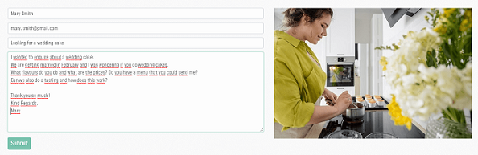
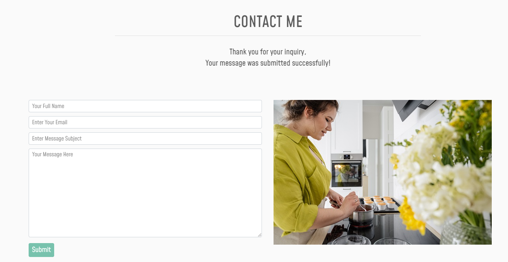
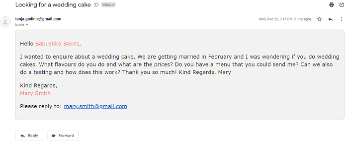

### **Conclusion**
Test passed, the functionality works as expected. 
  

## **The Blog**

* User Story:
    * *I want to be able to read the latest blog posts, so I that can find some reciepts that I can try to bake myself*  

### **Test**
The blog is accesible by the navbar menu link. The link leads to the **Blog Page** which has all the blog posts listed.\
The user can also access the blog from the menu in the footer.\
The user should not see the options to add/edit/delete the blog posts, unless they are logged in as a **Superuser**.\
A **User that is not logged in** and the **Guest User** should not be able to see those options and should only be able to read the blog. 

### **Result**
All the links were tested and they leed to the relevant pages.\
All buttons were tested and they all lead to the relevant pages.\
I have logged in as a **Superuser** and I was able to see the options to add/edit/delete the blog post.\
When I logged in as a **Guest User**, I could not see the options to add/edit/delete blog posts.\
When I was not logged in, I was not able to see those options neither.

### **Conclusion**

Test passed, everything functions as expected.

 

## **The Shop**

 ## **View Products**

User Stories:

* *I want to be able to view the products in the shop so that I can choose what to buy*  
* *I want to be able to see product details	so that I can find out if I want to purchase it*

The user can access the **Products** page from the Home page directly by clicking on the **View Shop** button or 
through the **Shop** navbar link.\
When they hover over the Shop button, the dropdown menu should appear and the user should be able to see all  categories of produts. 
They can also to click on **All Products** to see all products from all categories.

### **Test**

I have tested whether all links and buttons lead to the products page.\
From the Products page I have tested whether all the links and images when clicked, lead to the **Product Details** page

### **Result**

All links and buttons do indeed open the **Produts** page.\
The navbar dropdown menu opens on hover and displays product categories.\
All links and product images do lead to the **Product Detials** page, when clicked.

### **Conclusion**

Test passed, functionality works as expected.

## **Purchase Products**
User Stories:
* *I want to be able to add product to the cart so that I can purchase it*
* *I want to be able to adjust the items in cart so that I can purchase only products and amounts that I want*
* *I want to be able to see total of my cart at any time so that I can control my spending*
* *I want to be able to make a safe purchase so that I can trust that my payment details are confidential*
* *I want to be able to receive an email confirmation after purchase so that I can have the details of my order in case I need to contact the shop*

#### **Add To Cart**
To purchase the products, the shopper needs to navigate to the **Product details** page where they have the option to add a product to cart.\
They can choose the amount that they want, either by typing it into the input field or by clicking up and down arrows.\
The toast message should appear to tell them that their action was successful.\
To access the shopping cart the user can either click on the **Secure Checkout** button in the popup message, or by clicking on the shopping cart icon on top of the screen.\
In the shopping cart the user can review their order and update if required - by using **Update** and **Remove** buttons.\
As the user ads products to the shopping cart, the total amount should be shown in the page header under the cart icon at all times and update every time they add or remove a product.

### **Test**
* Adding product to cart by clicking the **Add to cart** button. Default value is set to 1.
* Typing the amount in the input field and clicking the **Add to cart** button
* Clicking the **Add to cart** button with no value in the field
* Clicking the **Add to cart** button with zero value in the field
* Clicking the **Add to cart** button with 21 products in the field. 
* Typing in 100 products and trying to add to cart

**Result**
* It is possible to add one item to cart with the default value 1
* Trying to submit with a zero typed in the field will throw an error.
* By default, the maximum amount the user can add to cart is 20 products. So when the user enters any number between 1 and 20, they can succesfully add it to cart. Should the user choose a number over 20 there will be a pop up warning saying that 20 products is maximum.
* Amending the amount by clicking up and down arrows will successfully change the product amount.
* Bug found: If the user adds maximum number of products to the cart and then goes back to the same product, and add more products, which will be over the allowed amount, the cart will update and the user is able to order more than 20 products. More about this in the [Bugs](#bugs) Section

**Conclusion**

The **Add To Cart** functionality works but it has its downsides and can cause potential problems for the site owner due to number of products ordered. This bug needs to be fixed as soon as possible.

### **Checkout**
To purchase the products the user clicks on the **Secure Checkout** button which should lead to the checkout page.\
On the checkout page the user needs to fill out their personal information, delivery information and payment details, and click **Complete Order** button.
The message should pop up advising the user that the order was successful and that they will receive an order confirmation email.

### **Test**
* I have tried to purchase products by clicking on the **Secure Checkout** button in the toast message and in the shopping cart 
* I have entered my information in the form and tried to pay for the products

### **Result**
* When clicking on the **Secure Checkout** button in the toast message I was successfully redirected to the **Checkout Page**. Apart from when clicking it after updating a product amount, the issue already described in [Bugs](#bugs) section.
* When clicking on the **Secure Checkout** button in on the bottom of the **Shopping Cart Page** I was successfully redirected to the **Checkout Page**. 
* When filling out the form it is clear which fields are required. The form will not submit if the fields mark with a * were not filled out. 
* When clicked on the  **Complete Order** button I receive a toast message saying that the purchase was successful and that I will recieve a confirmation email.
* Stripe webhook shows that the transaction was indeed successful 

  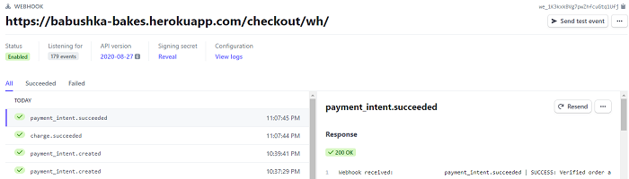

* The confrirmation email was successfully received.

  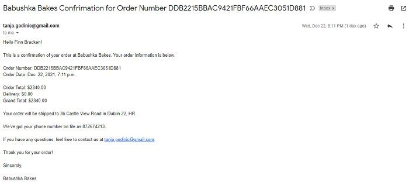

### **Conclusion**

Test passed, functionality works as expected.

 

## **CRUD operations**

The **Superuser** is the only one who is able to perform CRUD operations. The site owner can give superuser credentials to staff as required.

### **Product CRUD**
### **Blog CRUD**
## **Search Functionality**

User Story:

 * *I want to be able to search for products by name or description	so that I can find them easily without needing to go through all products*

 The search input is located at the top of every page which makes it easy for user to search for required items at any time. On mobile and tablet screens the search option is also visible in the page header and it will open an input field when clicked.  

 ### **Test**

 To test the search functionality I have tried inputting random words into search input field. 
 I also tried the same word with capital letter
 I have also tried to click search without inputting anything in the search field. 

 ### **Result**
 * If the searched word is a part of a product or its description, this product will display on the page. If they are not, we get no results.
* Search functionality is not case sensitive.

### **Conclusion**
Test passed, the functionality works as planned.

Although the search functionality works well for searching products, it should work across the page so user can search for any item, e.g blog post.. Due to lack of time I was not able to implement this for this release but it will be implemented in the future. 

 
 

## **Error Pages**

I have implemented Error 404 (Page Not Found) and Error 500 (Internal Server Error) pages as they are the most common erros that can occur.\
The goal is to prevent the user from leaving the page if error occurs so I've added a link back to the shop on the error page.

### **Test**
To test error 404 I have inputted a random word at the end of the page URL. e.g. https://babushka-bakes.herokuapp.com/lalala which should trigger the page 404. 

To test error 500 I have changed a template name. 

I have also tested links on the error pages
### **Result**

Inputting random word at the end of the URL does indeed trigger page 404.\
Wrong template name did trigger the page 500.\
Links do indeed lead to the shop page.

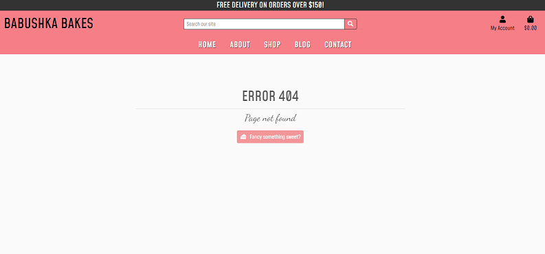
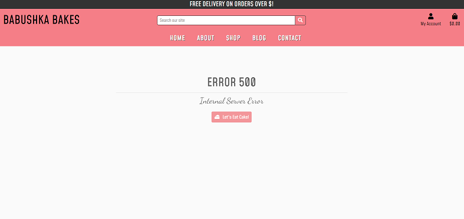

# **Functionality**

# **Bugs**

*  **Bug**: After setting up the **Add Product** page I was testing it and ended up gettting a 404 error for the whole site. I could no go back into it. The problem was that product was in the cart, so the browser "remembers" it, but when I deleted it form the databse, it could no longer find it. And since the cart is processed by contexts.py, it is present on every page, so I got the error anywhere I navigated to.

      **Fix**: I needed to clear the app storage. In the Dev Tools, in the Application tab, I selected the Storage from the sidebar, then clicked the **Clear Site Data** button. With this I emptied the cart and the issue was fixed. 

* **Bug**: After deployment to heroku and connecting django to AWS S3 bucket I was suddenly getting an error: 
        
        <Error>
        <Code>SignatureDoesNotMatch</Code>
        <Message>
        The request signature we calculated does not match the signature you provided. Check your key and signing method.
        </Message>

  **Fix**: It turned out that I needed to add a AWS_S3_ADDRESSING_STYLE = "path" setting to settings.py which seems to specific setting for the eu-central-1 region.

* **Bug**: Search functionality doesn't work for the entire page. It works only for products which is not great for user experience.  

  **Fix**: This will be fixed as soon as possible but since the time was limited the issue remains.

* **Bug**: The maximum amount of each product that the user should be able to add into the cart is set to 20. However there is a bug allowing the user to add more of the same product. If the user adds one product and then goes back to the same product page, they will be able to add more products to the cart. The cart will accept it and the user is able to finish the transaction and pay for the order. 

    **Fix**: I wanted to implement the fix by adding the check in the checkout page, to check if any line_item has quantity over 20, to display a message saying they should contact the site owner, otherwise to allow normal checkout procedure. Again, the time was limited and sadly I was not able to finish this fix.  

* **Bug**: The **Secure Checkout** button in the toast message doesn't seem to work if the shopping cart has been updated. If the user ads a product to the cart and then clicks **Secure Checkout** in the toast message, the button works. However if the user changes the product amount by clicking on the **Update** button, and then tries to go to secure checkout via the button in the toast message, the link will not work. Page will just referesh. The other **Secure checkout** button on the bottom of the page, works perfectly no matter if there was an update or not. 

  **Fix**: I haven't been able to figure out why this happens. If the time allowed I would have investigated further but unfortunately it did not.   

* **Bug**: The **Remove** button in the shopping cart also behaves differently at different times. Sometimes it removes the items and sometimes throws an error. If it throws an error and if you go back to the cart with the browser arrow, the item will indeed be removed.

  **Fix**: I was talking to the tutor support regarding this issue and when they tested it, it was working for them. It was two different tutors on two different occasions. They were also not sure if the issue is happening because of Heroku having issues at the time. Since it was working for them I decided to leave it as it.

# **Important**

During the process of copying the data from the SQLite3 database to the Postgress database, I have accidentally used the wrong command and commited my db.json file along with the auth permissions to GitHub. When I realized what had happened, I had already made many more commits on top of that one so it was not possible to just revert a commit. I have searched for the best solution to rectify this and have found that there is a way of going into the git commit history and remove it from the commits, either by the rebase or the cherry-pick commands. However, since the file was in the git history for significant amount of time and there were many more commits done after that one, I believe that it takes much more experience to tackle this issue. I was coming very close to the submit deadline and I did not dare to mess with the commit history. I have also consulted my mentor and I decided to take his advice. I removed the existing db.json file, and created a new fixture file for each app separately, to be certain to not include the auth perissions. For that I have used the following  command: 

    ./manage.py dumpdata <app name> > <app name>.json

This created new json files that were safe to commit as they did not contain any sensitive info. Since the db.json file with the sensitive information was in the git history for quite a long time, I have also decided to rotate my secret keys, so I created a new secret key for Gitpod and for Heroku. 

I understand the seriousness of this mistake and the damage it could have done if this was a real world application with real users details. I sincerelly hope that rectifying it will be sufficient to show that I have learned from this experience and dealt with the issue the best way I could.   

 

