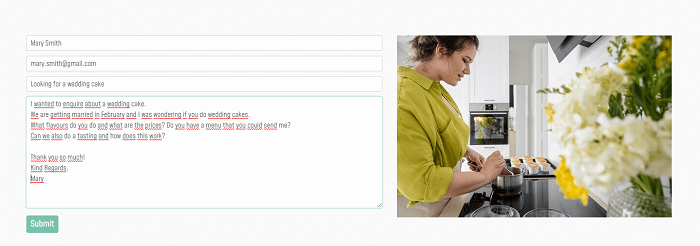

# **Testing**

## Table of contents 
* [Code Validation](#code-validation)
* [Responsiveness](#responsiveness)
* [User Stories](#user-stories)
* [Functionality](#functionality)
    * [My Profile](#my-profile)
    * [Shop](#shop)
    * [Navigation](#navigation)
    * [Footer](#footer)
    * [Search](#search)
    * [Blog](#blog)

 

# **Code Validation**

### **HTML**
All the HTML files were validated with [HTML Validator](https://validator.w3.org/). There was only a few minor errors such as double closing tags or missing tags. These errors were fixed and there are no errors or warnings left. 

### **CSS**
All the CSS files have passed the [CSS Validator](https://jigsaw.w3.org/css-validator/) without issues.

### **JavaScript**
All the javascript were validated with the [Javascript Validator](https://jshint.com/) 

* Missing semicolon was added
* Undefined variable ($) warning was not changed or fixed as it would lead to code not working  
* The warning 'template literal syntax' is only available in ES6 (use 'esversion: 6'), was fixed by changing jshint configuration to ES6

### **Python**

All the python files were validated with the [Pep8 Python validator](pep8)

Most common errors / warnings were:
* Blank line contains whitespace
* Trailing whitspace
* Line too long - some of which could not be corrected as it would break the code
* Missing docstring
* Unused imports
* No new line at the end of file
* Expected two blank lines, found one
* Too many blank lines

Majority of the errors and warnings was fixed, however some still remain, becasue breaking those lines would break the code:
* "Line too long" in migration files
* "Line too long" in settings file
* "Avoid using null=True on string-based fields such CharField" in some models

  

# **Responsiveness**

### **Test**
I was regularly checking responsiveness during development with Chrome developer inspector tools.\
I have tested the deployed site with help of the app called [Responsively](https://responsively.app/)
Test was also done on the actual devices: Lenovo Laptop 17.3" / Alpha a1 20+ / Xiaomi Redmi 9t /  iPhone 7 / iPhone 8 / iPhone 10 / iPad 

### **Result**
The page looks satisfactory on all tested devices and is fully responsive. The Navigation menu collapses on tablet and mobile sizes and expands on desktop size. Hero image is not destorted and displays nicely on all screen sizes tested. 

Images on all other pages are responsive, they are rendering well on all screen sizes tested without overflowing or distorsion.
Text responsiveness is satisfactory.

### **Conclusion**
Test result is satisfactory, everything is functioning as intended.

 
 

# **User Stories**

## **Navigation and rensponsiveness**
### **All users** 

User Story:
* *To have a website that is clean and easy to navigate and displays well on all devices*

Responsiveness was covered in the separate section above, and the results are satisfactory.

Navigation bar is visible on all pages of the website  which makes it easy for user to browse around and contributs to a smoother user experience.

On smaller sizes, the navigation menu collapses to a hamburger button which expands on click. 

### **Test**

**Navigation menu items**

* Clicked on each navigation menu item to make sure that they each lead to their respective pages. 
* Clicked on the **View Shop** and **Contact Me** buttons to make sure that they lead to their respective pages. 

**Footer menu items**

* Clicked on each navigation menu item in the footer to make sure that they lead to their respective pages. 

**Social Media Icons**

* Clicked on each social media icon in the footer to make sure that they lead to their respective pages. 

**Buttons**

* Clicked on each button on all pages of the website to make sure they will lead to the relevant page. 

**Brand Name**

* To return to the **Home** Page, the user can click on the brand name in the top left corner and will be redirected to the home page. 

### **Result**  

No broken links in navbar, all pages open as expected.\
**Shop** link opens a dropdown menu on hover, as expected.\
Social media icons lead to their respective generic page and open in a separate tab.\
All buttons work as expected and lead to their respective pages.

### **Conclusion**
Test passed, all functions work as expected.

  

## **Account Creation and Profile Management**
### **Site Visitor**

This is first time visitor as well as a returning visitor who hasn't created an account previously.

* User Stories:
    * *As a	site visitor I want to be able to:*
        * *Easily register for an account so that I can have my account and view my profile.*
        * *Easily login and logut* 
        * *Easily recover my password if neccesary*

### **Test**

The **My Account** icon is placed in the website header and it is clearly visible and accessible from any page of the website.

Visitor can click on the **My Account** icon and will see the options to **Login** or **Register**

When the visitor clicks on **Register** they will be presented with a  form asking for their details. After submitting the form, an email confirmation will be required. When the visitor confrims their email, they will be able to log in with their new credentials.

As a **logged-in** user, the user can now see additional option in the **My Account** dropdown menu - **Profile Management**. From here the user can update their profile information that are saved for future purchases.

In case the user forgets their password, they can click on the **Forgot Password?** link and follow the instructions to change the password.

When finished, the user can easily log out by clicking the **Logout** link in the **My Account** menu. They will be asked to confrim if they really want to logout in case they have clicked this link by accident.  

### **Result**  
I have followed the proces several times and created several users. The process is simple and intuitive and the visitor can create their account with a few clicks, easily manage their profile and logout.

### **Conclusion**
Test passed, the function works as expected. 

 

## **Contact**

* User Story:
    * *As a user I want to be able to contact the store owner to ask a question regarding products or place a custom order*

The user can contact the site owner easily with a few options. There is a **Contact** menu item in the navabr that will lead to the **Contact Page**. There is also a menu link in the footer, available on each page (apart from the home page) that also leads to the Contact Page. On the home page, the user has the **Contact Me** button, as well as the navbar menu link to the Contact Page.

When on the contact page, the user has a few options for contact:
* They can fill out the contact form and their message will land directly in the site owners email.\
* There is a contact number, an email address as well as the postal address, should that be their preffered way of contacting the site owner. 
* The user also has the **Social Media** option to contact the site owner. Currently the links lead to the generic pages but in the future, Petra's actual social media handles will be added. 

### **Result** 
I have tested all the links and they all correctly lead to the Contact Page.\
I have also sent several emails from the contact form and confirmed that the email is indeed sent, and recieved by the site owner (my own email in this case).

### **Conclusion**
Test passed, the function works as expected. 
  

## **The Blog**

* User Story:
    * *I want to be able to read the latest blog posts, so I can find some reciepts that I can try to bake myself*  

The blog is accesible by the navbar menu link. The link leads to the **Blog Page** which has all the blog posts listed. 

 A **Logged in user**  can see the options to create a new blog post, edit and/or delete an existing blog post.

All buttons were tested and they lead to relevant pages.

A **User that is not logged in** will not see those options and will only be able to read the blog. 

### **Conclusion**

 

## **The Shop**

 ### **View Products**

User Stories:

* *I want to be able to view the products in the shop so that I can choose what to buy*  
* *I want to be able to see product details	so that I can find out if I want to purchase it*

The user can access the **Products** page from the Home page directly by clicking on the **View Shop** button or 
through the **Shop** navbar link.\
When they hover ove the Shop button the dropdown menu will  appear and the user can choose which category of products they wish to go to.
Or they have the option to click on **All Products"

### **Test**

I have tested whether all links and buttons lead to the products page.\
From the Products page I have tested whether all the links and images when clicked, lead to the **Product Details** page

### **Result**

All links and buttons do indeed open the **Produts** page\
The navbar dropdown menu opens on hover and displays product categories\
All links and product images do lead to the **Product Detials** page when clicked

### **Conclusion**

Test passed, functionality works as expected.

### **Purchase Products**
User Stories:
* *I want to be able to add product to the cart so that I can purchase it*
* *I want to be able to adjust the items in cart so that I can purchase only products and amounts that I want*
* *I want to be able to see total of my cart at any time so that I can control my spending*
* *I want to be able to make a safe purchase so that I can trust that my payment details are confidential*
* *I want to be able to receive an email confirmation after purchase so that I can have the details of my order in case I need to contact the shop*

#### **Add To Cart**
To purchase the products the shopper needs to navigate to the **Product details** page where they have the option to add a product to cart.\
They can choose the amount that they want either by typing it into the input field or by clicking up and down arrows.\
The message should appear to tell them that their action was successful.\
To access the shopping cart the user can either click on the **Secure Checkout** button in the popup message or by clicking on the shopping cart icon on top of the screen.\
In the shopping cart the user can review their order and update if required - by using **Update** and **Remove** buttons.\
As the user ads products to the shopping cart, the total amount should be shown in the page header under the cart icon at all times.\

#### **Checkout**
To purchase the products the user clicks on the **Secure Checkout** button which should lead to the chekcout page.\
On the checkout page the user needs to fill out their personal information, delivery information and payment details, and click **Complete Order** button.
The message should pop up telling the user that the action was successful and that they will receive confrimation email.

### **Conclusion**

Test passed, functionality works as expected.

 

## **Search Functionality**

User Story:

 * *I want to be able to search for products by name or description	so that I can find them easily without needing to go through all products*

 The search input is located at the top of every page which makes it easy for user to search for required items at any time. On mobile and tablet screens the search option is also visible in the page header and it will open an input field when clicked.  

 ### **Test**

 To test the search functionality I have tried inputting random words into search input field. 
 I also tried the same word with capital letter
 I have also tried to search without inputting something in the search field. 

 ### **Result**
 * If the searched word is a part of a product or its description, this product will display on the page. If they are not, we get no results.
* Search functionality is not case sensitive.

### **Conclusion**
Test passed, the functionality works as planned.

 
 

# **Functionality**

# **Bugs**

# **Important**

During the process of copying the data from the SQLite3 database to the Postgress database, I have accidentally used the wrong command and commited my db.json file along with the auth permissions to GitHub. When I realized what had happened, I had already made many more commits on top of that one so it was not possible to just revert a commit. I have searched for the best solution to rectify this and have found that there is a way of going into the git commit history and remove it from the commits, either by the rebase or the cherry-pick commands. However, since the file was in the git history for significant amount of time and there were many more commits done after that one, I believe that it takes much more experience to tackle this issue. I was coming very close to the submit deadline and I did not dare to mess with the commit history. I have also consulted my mentor and I decided to take his advice. I removed the existing db.json file, and created a new fixture file for each app separately, to be certain to not include the auth perissions. For that I have used the following  command: 

    ./manage.py dumpdata <app name> > <app name>.json

This created new json files that were safe to commit as they did not contain any sensitive info. Since the db.json file with the sensitive information was in the git history for quite a long time, I have also decided to rotate my secret keys, so I created a new secret key for Gitpod and for Heroku. 

I understand the seriousness of this mistake and the damage it could have done if this was a real world application with real users details. I sincerelly hope that rectifying it will be sufficient to show that I have learned from this experience and dealt with the issue the best way I could.   

 

